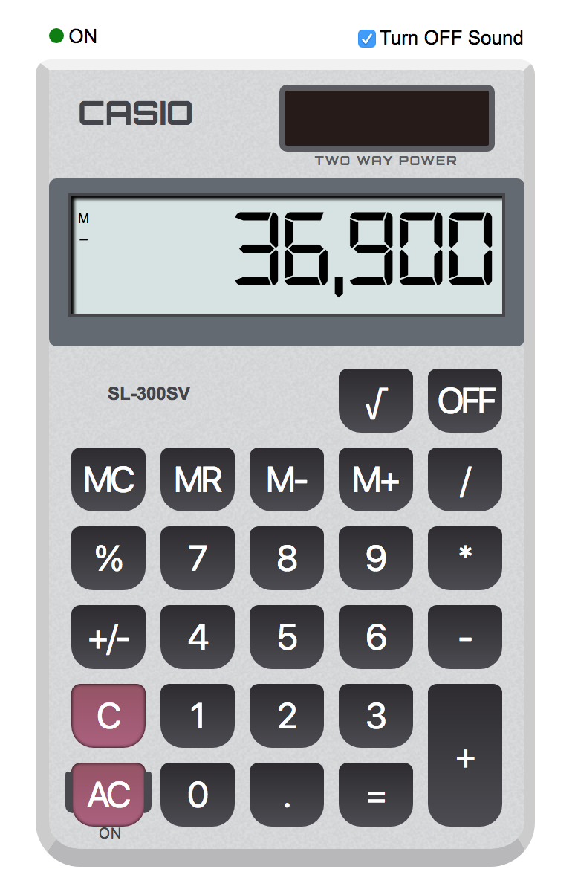

# Scientific Calculator
An online calculator with HTML5 technologies.

### For Development

**Step 1**: Install the dependencies via `npm`
    
    npm install

**Step 2**: Start the dev server.

    npm run dev

For hot reloading, please run:

    npm run hot

To watch for file changes, please run:

    npm run watch

**Step 3**: Edit the code in `src` the output will be compiled into `dist`

## Running the tests

All the tests are stored inside the `test` folder. Please run the below command to run the unit tests.
    
    npm run test

## Screenshots

### Calculator

### Test

## Deployment
Please run the below command which will compile and prepare the code in `dist` folder.

    npm run production

## Built With

* HTML5
* CSS 3
* ES 6
* [Vue](https://vuejs.org/) - The Progressive
JavaScript Framework
* [Laravel Mix](https://github.com/JeffreyWay/laravel-mix) - An elegant wrapper around Webpack for the 80% use case.

## Author

    Mahendran Kannan
    mahendrankannan@yahoo.com
